# 🍃 SustainIQ: AI-Powered Sustainable Living Platform

<p align="center">
  
  
  
  
  
  
</p>

---

## 📌 Project Overview
**SustainIQ** is a next-generation, AI-powered sustainable living platform designed to help individuals understand, track, forecast, and actively reduce their ecological footprint. Built with a futuristic **dark-green glassmorphism theme**, SustainIQ integrates carbon calculations, real-time habits simulations, machine forecasting, interactive weekly/monthly tasks, and educational guide centers to empower eco-action.

> 🏆 **Project Type:** PromptWars Challenge 3 Submission  
> 💡 **Core Value:** Translating personal habits data into immediate environmental insights, goals, and community standings.

---

## ⚠️ Problem Statement
Global carbon dioxide emissions remain at historic highs, driven substantially by domestic utility demand, waste handling, consumer transport, and agricultural dependencies. Although many citizens wish to make eco-friendly changes, they face significant barriers:
* **The "Invisible" Footprint:** Carbon footprints are difficult to quantify in daily life.
* **Analysis Paralysis:** Users don't know which habits yield the highest CO2 reductions.
* **Lack of Engagement:** Traditional trackers feel like boring logs rather than rewarding challenges.
* **No Projection Data:** Users cannot visualize where their current consumption will lead them in the future.

---

## 🌟 Solution Overview
**SustainIQ** solves these challenges by combining visual calculations with a gamified rewards system and custom projections:
1. **Interactive Tracking:** Provides immediate categorical breakdowns of emissions.
2. **Impact Sandbox:** Let users simulate the financial and carbon savings of habit shifts BEFORE committing to them.
3. **AI Projections:** Shows where user emissions will trend 6 months into the future.
4. **Gamification:** Rewards points and unlocks milestones achievements when users complete eco-challenges.

---

## 🛠️ Key Features

| Feature | Description | Highlight |
| :--- | :--- | :--- |
| 📊 **Sustainability Dashboard** | Displays sustainability scores, carbon statistics, eco points, activities, and badges. | Glassmorphic meters & dials |
| 🧮 **Carbon Footprint Calculator** | Logs and calculates transport mileage, utility kWh, diet profiles, and waste bags. | Live donut breakdowns |
| 🎛️ **Green Impact Simulator** | Toggles lifestyle actions (EVs, solar panels, diets) to compare current vs. green profiles. | Real-time comparative bar charts |
| 🤖 **AI Sustainability Assistant** | Conversational coach (SustainAI) answering eco questions and rotating daily facts. | Natural keyword parsing |
| 📈 **Carbon Emission Prediction** | Extrapolates 6-month historical calculations into future green vs. baseline trendlines. | Regression prediction line graphs |
| 🏆 **Eco Challenges** | Daily and weekly tasks that reward eco points and update user ranks. | "Mark Done" & "Claim Reward" rules |
| 🎯 **Sustainability Goals** | Custom monthly and yearly goals with automated circular progress meters. | Progress logging and rewards |
| 🏅 **Leaderboard** | Global community rankings sorting users by accumulated eco points. | Dynamic active user placement |
| 📄 **Reports & Analytics** | Renders printable statement grades and exports raw CSV data logs. | Optimized physical print stylesheet |
| 👤 **Profile Management** | Captures credentials, household metadata, statistics, and unlocked badges. | Interactive achievements grid |
| ⚙️ **Settings Page** | Toggles Dark/Light themes, updates notification triggers, and resets local caches. | Seamless custom variables transitions |
| 📚 **Learning Hub** | Houses daily eco-facts, recycling guides, and search engines for sorting materials. | Recycling guides search index |

---

## 💻 Technology Stack
* **Frontend Core:** HTML5 (semantic layouts) & CSS3 (glassmorphic styling, custom keyframe transitions, variables themes).
* **Scripting Logic:** Vanilla JS (ES6+ modular code architecture, state store management, local storage syncing, router events).
* **Analytics Rendering:** Chart.js via CDN (doughnut charts, double y-axis line charts, comparative bar graphs).
* **Graphic Assets:** Lucide Icons CDN (vector icons rendering).
* **Hosting Configuration:** Vercel static routing rules engine (`vercel.json`).

---

## 📸 Application Screenshots

### 🏠 Landing Page
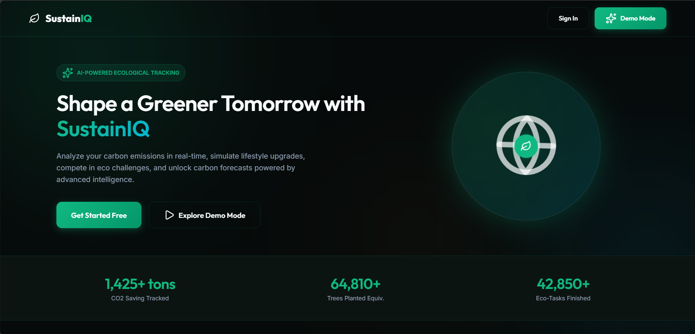

### 📊 Dashboard Overview
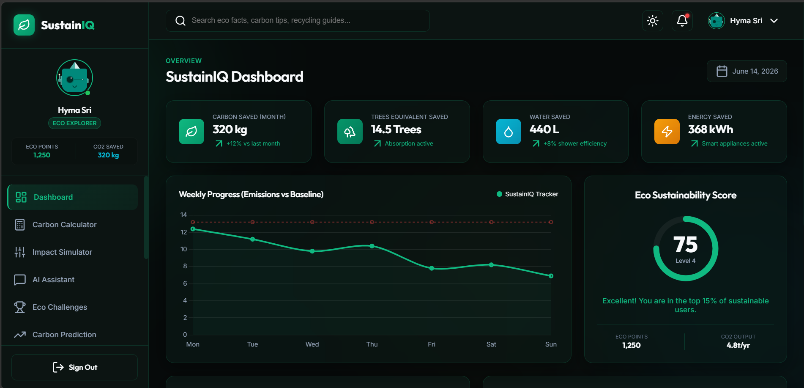

### 🏆 Dashboard Achievements
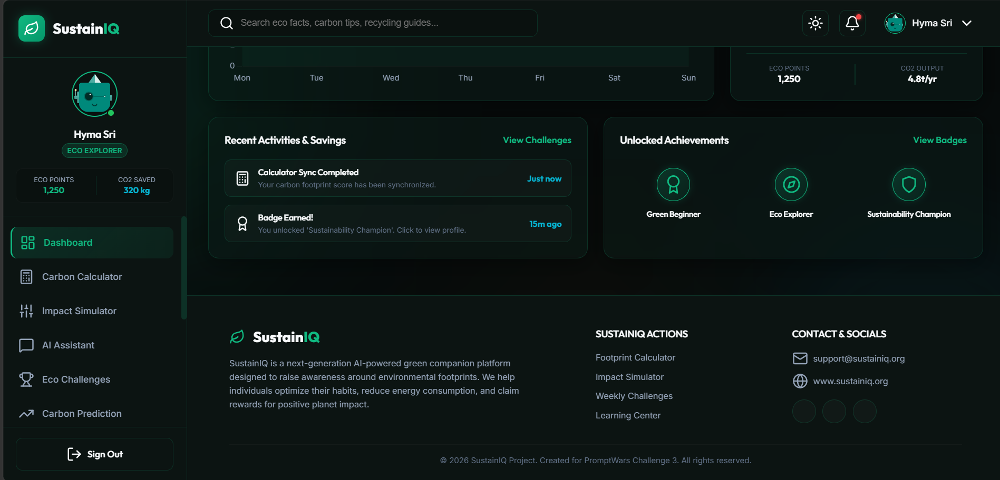

### 🧮 Carbon Calculator
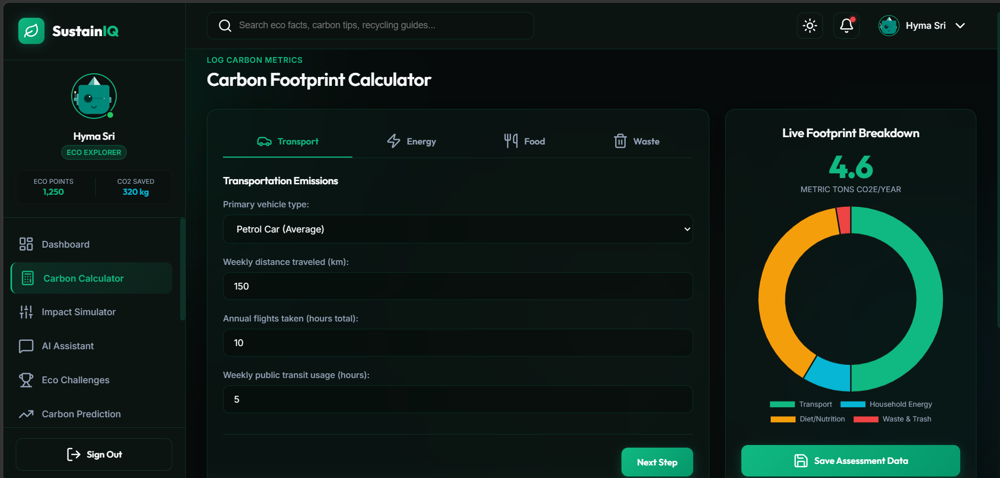

### 🌱 Green Impact Simulator
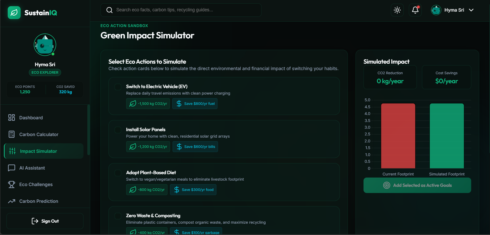

### 🤖 AI Sustainability Assistant
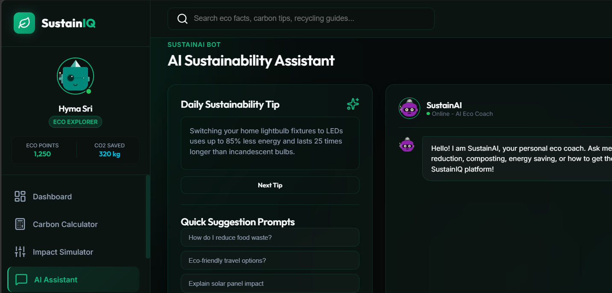

### 💬 AI Chat Interface
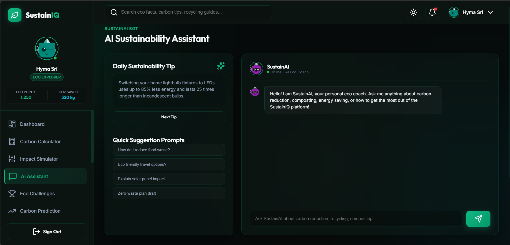

### 🎯 Eco Challenges
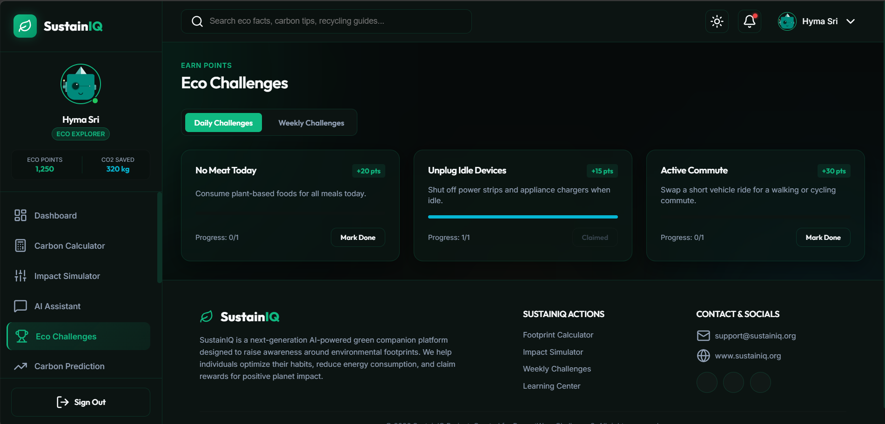

### 📈 Carbon Emission Prediction
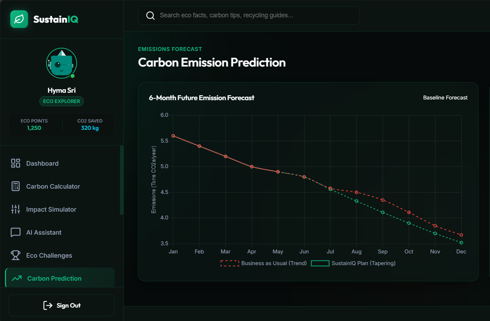

### 🎯 Sustainability Goals
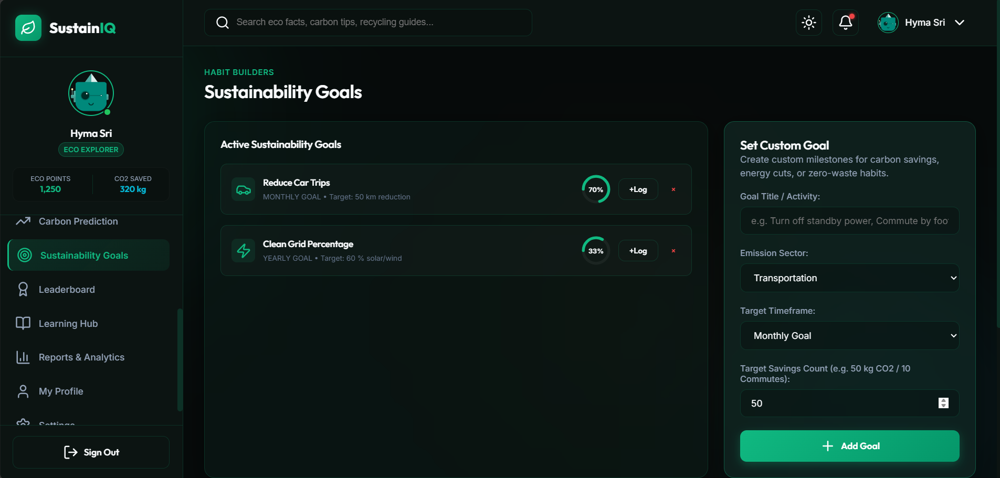

### 🏅 Leaderboard
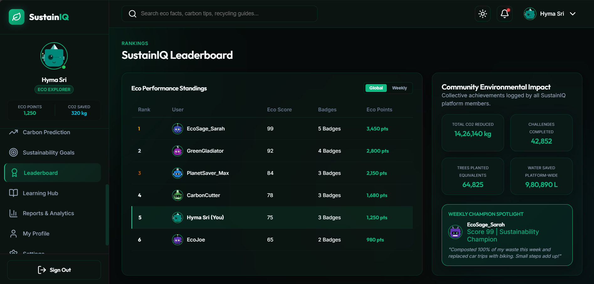

### 📚 Sustainability Learning Hub
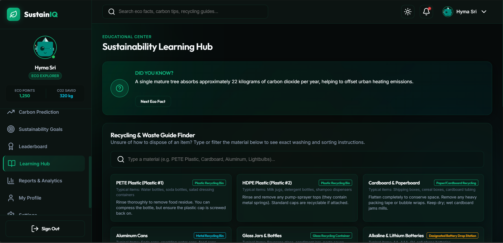

### 📑 Reports & Analytics
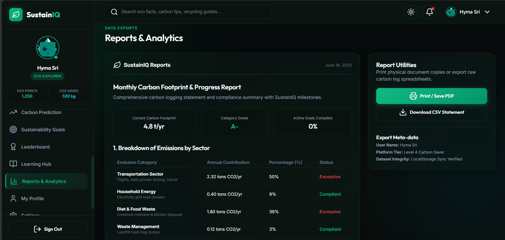

---

## 📂 Folder Structure
```bash
Carbon Footprint Awareness/
├── css/
│   └── style.css          # Custom glassmorphic styles, keyframes, variables
├── js/
│   ├── app.js             # Core state engine, router, theme and profile manager
│   ├── calculator.js      # Footprint formulas and donut charts controller
│   ├── simulator.js       # Action sandbox and comparative bar charts logic
│   ├── chatbot.js         # SustainAI bot responses and carousel tipping
│   ├── challenges.js      # Checklist trackers and points rewards claiming
│   ├── prediction.js      # Regression line chart projections forecaster
│   ├── goals.js           # Progress ring charts and goals creator forms
│   ├── leaderboard.js     # Standings merges and community stats calculations
│   ├── learning.js        # Guide search inputs and material details arrays
│   └── reports.js         # CSV generators, summary tables, and print configurations
├── index.html             # Main frame, modals, footers, page section structures
├── vercel.json            # Deployment routing rules
└── README.md              # Documentation
```

---

## 🚀 Installation and Local Setup

### Prerequisites
You only need a modern web browser. There are no backend database installations or NPM compile configurations.

### Steps
1. **Clone the Repository:**
   ```bash
   git clone https://github.com/yourusername/sustainiq.git
   cd sustainiq
   ```
2. **Open the Project:**
   Double-click the `index.html` file to launch it directly in your web browser.
3. **Run with Live Server (Recommended):**
   If you use VS Code, install the **Live Server** extension, right-click `index.html`, and select **Open with Live Server**. Alternatively, run Python's built-in server:
   ```bash
   python -m http.server 8000
   ```
   Then navigate to `http://localhost:8000`.

---

## 🌐 Deployment Instructions

### Deploying to GitHub Pages
1. Push your files to a GitHub repository.
2. Go to **Settings** -> **Pages** in your repository dashboard.
3. Choose the `main` branch and `/` root directory, then click **Save**.

### Deploying to Vercel
SustainIQ is configured out-of-the-box for Vercel deployment:
1. Install Vercel CLI: `npm install -g vercel`
2. Run command: `vercel`
3. Vercel automatically reads the `vercel.json` file, registers static routing configurations, and deploys.

---

## 🔮 Future Enhancements
* **Real AI Integrations:** Hook up chatbot dialogs to OpenAI or Gemini API endpoints for deep sustainability tutoring.
* **Carbon API Integrations:** Pull regional grid factors and flight emission details dynamically from APIs like Climatiq.
* **User Authentication Backend:** Move local storage caching to PostgreSQL/Node.js backend accounts.
* **Community Features:** Create real-time team challenges and collaborative neighborhood projects.
* **Mobile App:** Build a React Native or Flutter wrapper to support daily widget push alerts.

---

## 🚧 Challenges Faced
1. **Canvas Lifecycle Management:** Chart.js does not allow double-rendering on a single canvas coordinate. We solved this by keeping global instances of active charts on the `window` namespace and explicitly calling `.destroy()` before redraws.
2. **Zero-Compile Router:** Creating clean routing state transitions without React or Next.js required a robust router. We designed a hash-based router (`window.onhashchange`) which works offline and triggers page-specific initializations dynamically.

---

## 🎓 Learning Outcomes
* **CSS Variable Themes:** Deepened expertise in managing complex custom properties to support theme toggling with zero flash.
* **Data Visualization Integration:** Formulated data structures to feed multiple chart styles (pie, bar, multi-axis lines) from a single user assessment database.
* **Design Systems:** Applied layout concepts like saturation grids, blur backdrops, neon glow boxes, and flexible borders.

---

## 🌍 Project Impact
SustainIQ raises awareness around everyday habits. By visualizing footprint statistics dynamically (showing that switching to EVs or solar panels can cut carbon output by 20%), the platform makes conservation targets feel achievable, motivating users to transition toward sustainable living.

---

## ✍️ Author
👤 **Narala Hyma Sri**
* **Role:** B.Tech Student | Data Analyst Aspirant
* **Bio:** Passionate about data analytics, statistics, dashboard visualization, and building tools to solve real-world problems.
* **Connect:** [LinkedIn](https://linkedin.com) | [GitHub](https://github.com)

---

## 🤝 Acknowledgements
* **PromptWars Judges** for providing clear criteria and design expectations.
* **Lucide Developer Community** for clear, lightweight SVG icon badges.
* **Chart.js Teams** for smooth, canvas-based tracking line graphs.

---

## 📄 License
This project is licensed under the MIT License - see the [LICENSE](LICENSE) file for details.
